## Hi there 👋  
Welcome to my GitHub profile!  

### 🚀 About Me  
- I’m currently working on many projects of different domains
- I’m learning **advanced programming concepts, AI/ML, and Full Stack Development.**  
- I enjoy **game development, automation, and connecting across devices.**  

### 🛠️ Technologies & Tools  
- **Programming:** Python, C#, C++, Angular, HTML.
- **Game Development:** Unity, DaVinci Resolve (for trailers), particle systems  
- **AI/ML:** TensorFlow, Pytorch, Pandas, Numpy, Matplotlib, OpenCV, etc.
- **Others:** Git, Docker, Curl, Discord Bot Development

### 🌟 Highlighted Projects  
- [Cosmic Conquest: Battle for the Void](https://mahmad777.itch.io/cosmic-conquest-battle-for-the-void): A sci-fi game with deep lore and challenging gameplay  
- Underground Heist: A dystopian hyper-casual game featuring high-tech grappling mechanics
- Digit Recognizer: A web app having CNN based model as backend
- Neural Network from Scratch: Just what the name says, in two languages though! Python and C++

### 📝 Latest Updates  
- **Currently:**
  - Learning foundations of AI
- **Future Plans:**
  - Learn DSA
  - Make more ML projects
  - Use cross-domain knowledge to make something innovative
  - Much more!

### 📈 Stats & More  
     
  

---
